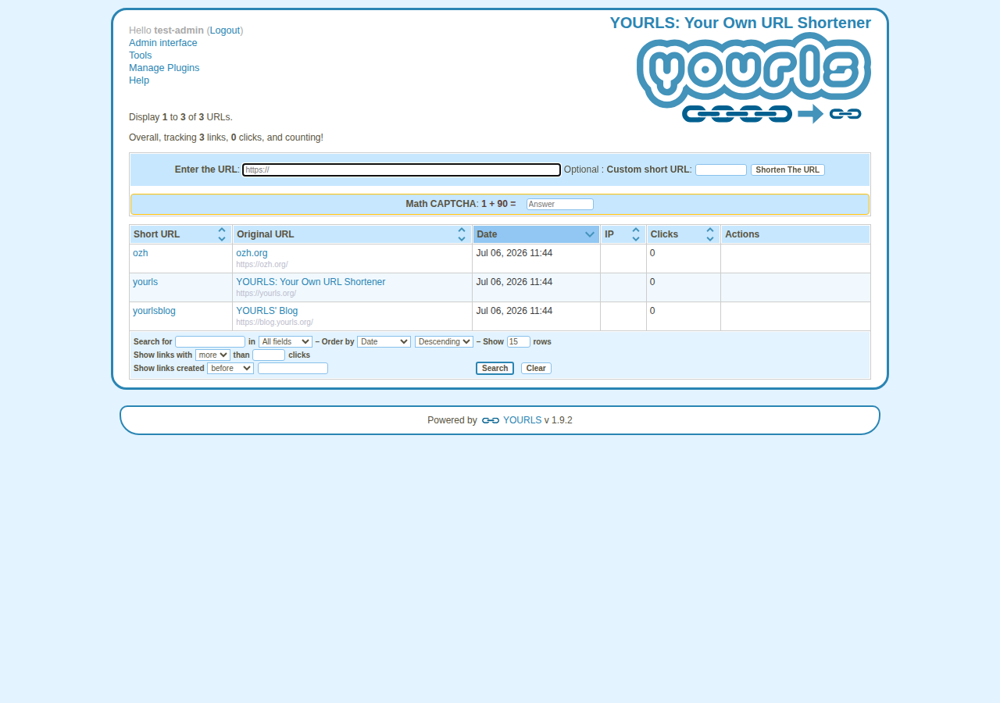
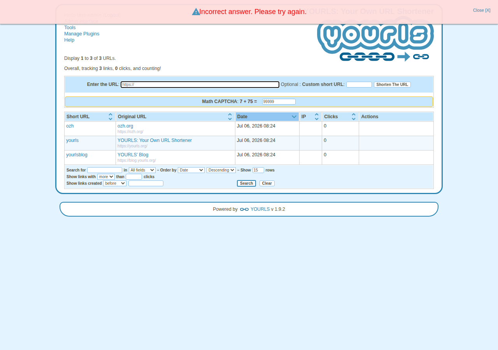
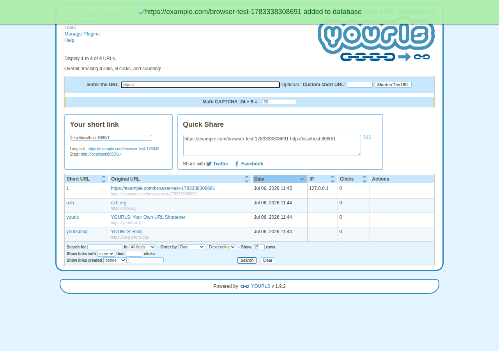
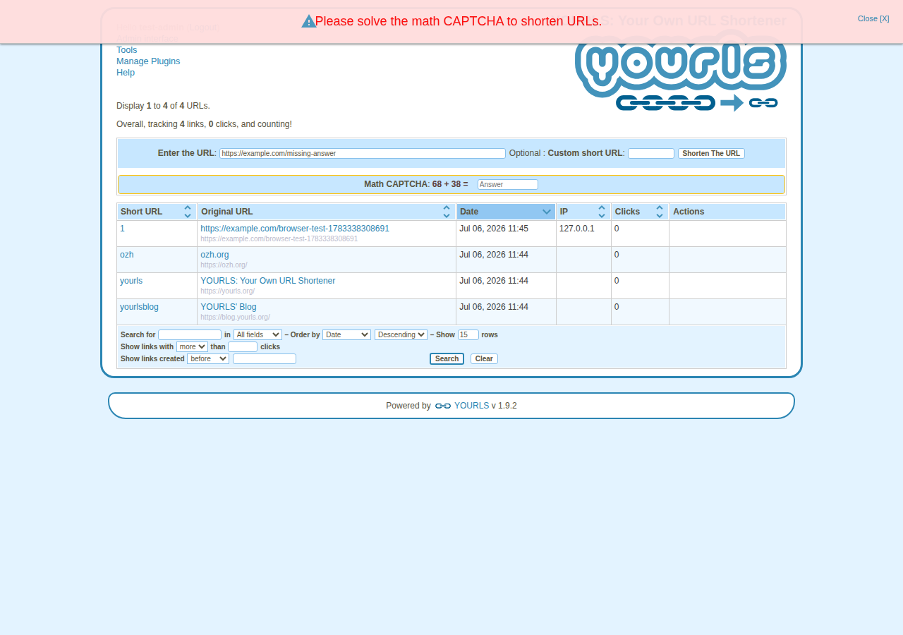
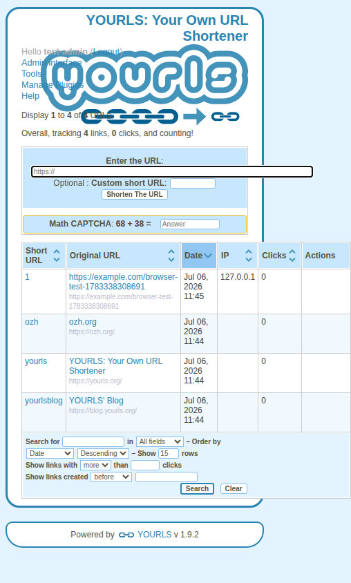

# Math CAPTCHA Plugin for YOURLS

A simple anti-spam plugin for YOURLS that requires users to solve a basic math addition problem before they can shorten a URL. This helps prevent automated bot submissions while keeping the user experience simple and accessible.

## Features

- **Simple Math Question**: Generates random addition problems with numbers between 1 and 99
- **Session-Based**: Each user gets a unique question that persists until solved
- **AJAX Support**: Works seamlessly with YOURLS' AJAX form submissions
- **Error Handling**: Provides clear feedback when the answer is incorrect or missing
- **Styling**: Includes CSS styling to make the CAPTCHA field visible and user-friendly
- **Accessible**: The answer field is programmatically tied to the question
  (`aria-describedby`) and requests a numeric keypad on mobile (`inputmode`)
- **Clean Code**: Well-structured, readable, and maintainable

## Screenshots

The screenshots below are captured automatically by the integration test suite
(see [Testing](#testing)) against a real YOURLS 1.9.2 installation.

The CAPTCHA field on the URL shortening form:



Close-up of the CAPTCHA field:


A wrong answer is rejected with an error message:



With the correct answer, the URL is shortened as usual:



Leaving the answer empty is blocked client-side before any request is sent:



The field also renders sensibly on a mobile viewport:



## Installation

1. Download the plugin or clone this repository
2. Copy the `math-captcha` folder to your YOURLS `user/plugins/` directory
3. Go to your YOURLS admin panel
4. Navigate to **Plugins** page
5. Activate the **Math CAPTCHA** plugin

## Usage

Once activated, the plugin automatically adds a math question field to the URL shortening form. Users must:

1. Enter the URL they want to shorten
2. Solve the math question (e.g., "25 + 37 = ")
3. Enter the answer in the provided field
4. Click "Shorten The URL"

If the answer is incorrect or missing, the plugin will display an error message and generate a new question.

**Note on Bookmarklets**: By default, CAPTCHA is skipped for bookmarklet requests since they don't display a form. If you want to enable CAPTCHA for bookmarklets, you would need to modify the plugin to handle bookmarklet-specific logic.

## Enabling the CAPTCHA on the public front page (unauthorized users)

Out of the box, YOURLS is a *private* installation: only logged-in admins reach
the URL shortening form, so the CAPTCHA only ever appears in the admin
interface. If you want unauthorized (not logged-in) visitors to be able to
shorten URLs from a public homepage, you have to opt in to YOURLS' public
interface — and then make sure the CAPTCHA renders and is styled there too.

1. **Make YOURLS public.** In your YOURLS `user/config.php`, set:

   ```php
   define( 'YOURLS_PRIVATE', false );
   ```

   With this off, anyone can reach the shortening API/form without logging in.

2. **Use the ready-made public front page.** This plugin ships a
   [`sample-public-front-page.txt`](sample-public-front-page.txt) template that
   is already wired for the CAPTCHA. Copy it into the **root** of your YOURLS
   install and rename it to `.php` — typically as `index.php`:

   ```sh
   cp sample-public-front-page.txt /path/to/yourls/index.php
   ```

   Unauthorized visitors now get a shortening form with the math question,
   styled, and enforced.

Why a dedicated template? YOURLS' own `sample-public-front-page.txt` echoes its
form markup directly and never calls `yourls_html_addnew()`, so the
`html_addnew` action — where this plugin injects its CAPTCHA field — never
fires, and no CAPTCHA would appear. The bundled template fixes that in two
places:

- **The field** is rendered by calling `yourls_do_action('html_addnew')` inside
  the form, so the plugin's question and answer box show up (alongside anything
  else hooked there).
- **The styling** is admin-only by default (the CSS is attached to the
  `admin_page_before_form` hook), so the template loads it explicitly with
  `math_captcha_add_css()` for the public page.

**Verification needs no extra code.** `yourls_add_new_link()` triggers the
`shunt_add_new_link` filter, which is exactly where this plugin checks the
answer — so a wrong or missing answer is rejected on the public page just as it
is in the admin.

**No client-side JS on the public page.** The bundled JavaScript
(`math_captcha_add_js`) wraps YOURLS' *admin* `add_link()` / `feedback()`
functions, which don't exist on a public front page, so it is intentionally
left admin-only. The public page still gets full server-side protection; add an
inline hint tailored to your own form markup if you want one.

### Already customized YOURLS' own sample? Apply the diff

If you started from YOURLS' stock `sample-public-front-page.txt` and don't want
to lose your customizations, the same integration is only a few lines. This
repo ships those changes as a patch —
[`docs/captcha-public-front-page.patch`](docs/captcha-public-front-page.patch) —
which applies cleanly on top of the stock YOURLS sample:

```sh
# from your YOURLS root, against the stock sample-public-front-page.txt
patch -p1 < /path/to/math-captcha/docs/captcha-public-front-page.patch
```

The diff itself:

```diff
--- a/sample-public-front-page.txt
+++ b/sample-public-front-page.txt
@@ -74,6 +74,11 @@

 		$site = YOURLS_SITE;

+		// Load the Math CAPTCHA styling (normally only added on admin pages).
+		if ( function_exists( 'math_captcha_add_css' ) ) {
+			math_captcha_add_css();
+		}
+
 		// Display the form
 		echo <<<HTML
 		<h2>Enter a new URL to shorten</h2>
@@ -81,6 +86,13 @@
 		<p><label>URL: <input type="text" class="text" name="url" value="http://" /></label></p>
 		<p><label>Optional custom short URL: $site/<input type="text" class="text" name="keyword" /></label></p>
 		<p><label>Optional title: <input type="text" class="text" name="title" /></label></p>
+HTML;
+
+		// Render the Math CAPTCHA field. The stock sample never fires the
+		// 'html_addnew' action this plugin hooks into, so trigger it here.
+		yourls_do_action( 'html_addnew' );
+
+		echo <<<HTML
 		<p><input type="submit" class="button primary" value="Shorten" /></p>
 		</form>
 HTML;
```

Server-side verification still needs nothing added — it rides along on
`yourls_add_new_link()` as described above. (Line numbers are for the current
YOURLS sample; `patch` will apply with a small offset against older versions.)

For background on YOURLS' public interface, see the
[YOURLS public server documentation](https://yourls.org/#Public).

## Requirements

- YOURLS 1.7 or higher
- PHP 7.1 or higher (the plugin uses `void` return types and scalar type hints)
- JavaScript enabled in the browser (for AJAX form submissions)
- PHP sessions must be enabled on your server

## Customization

You can modify the plugin behavior by editing the `plugin.php` file:

- **Change number range**: Edit the `math_captcha_generate_question()` function to change the range of numbers (currently 1-99)
- **Change styling**: Modify the CSS in the `math_captcha_add_css()` function
- **Change error messages**: Update the messages in the `math_captcha_verify_on_add()` function

## Testing

The plugin ships with a full test suite:

- **Unit tests** (`tests/MathCaptchaTest.php`): PHPUnit tests against a mocked
  YOURLS API — `composer install && composer test`
- **Integration tests** (`tests/integration/`): install a real YOURLS with the
  plugin activated and exercise the CAPTCHA through the admin interface
- **Browser screenshots** (`tests/integration/screenshots.mjs`): a Playwright
  script drives Chromium through the login, wrong-answer, and correct-answer
  flows, verifying the plugin's JavaScript hook and capturing the screenshots
  shown above

Everything runs automatically in GitHub Actions on every push and pull
request; the screenshots are uploaded as a workflow artifact. See
[INTEGRATION_TESTING.md](INTEGRATION_TESTING.md) for the full documentation.

## Files

- `plugin.php` - Main plugin file with all the PHP logic, embedded JavaScript, and CSS
- `sample-public-front-page.txt` - Ready-to-use public front page template with the CAPTCHA wired in (see [Enabling the CAPTCHA on the public front page](#enabling-the-captcha-on-the-public-front-page-unauthorized-users))
- `docs/captcha-public-front-page.patch` - Patch that adds the CAPTCHA integration to YOURLS' own stock sample front page
- `README.md` - This documentation file
- `docs/screenshots/` - Screenshots captured by the integration test suite
- `tests/` - Unit and integration tests (see [INTEGRATION_TESTING.md](INTEGRATION_TESTING.md))

## How It Works

1. **Question Generation**: When the form is displayed, the plugin generates a random addition problem and stores both the question and answer in the user's session.

2. **Form Integration**: The plugin adds a new field to the URL shortening form displaying the math question and an input for the answer.

3. **Verification**: When the form is submitted, the plugin intercepts the request via the `shunt_add_new_link` filter and verifies the user's answer against the stored answer in the session.

4. **Result Handling**: 
   - If correct: The URL is shortened normally
   - If incorrect or missing: An error is returned and a new question is generated

## Security Notes

- The plugin uses PHP sessions to store the question and answer, which are server-side and not visible to the client
- The answer is only valid for the current session, preventing replay attacks
- A new question is generated after each attempt (successful or not)
- The plugin sanitizes all output to prevent XSS attacks

## License

This plugin is released under the [MIT License](LICENSE), the same as YOURLS itself. Feel free to use, modify, and distribute as needed.

## Support

For issues, questions, or suggestions, please open an issue on the [GitHub repository](https://github.com/MarcProe/simple-antispam).
